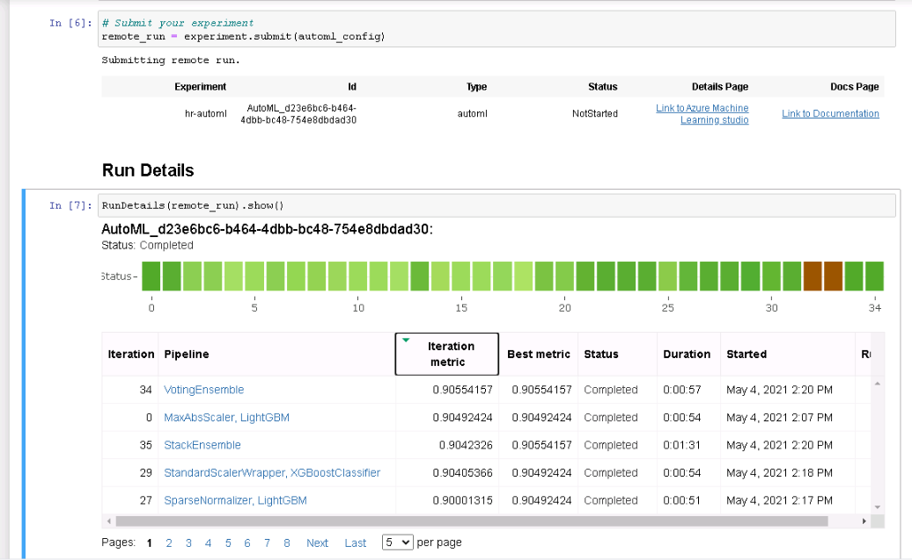
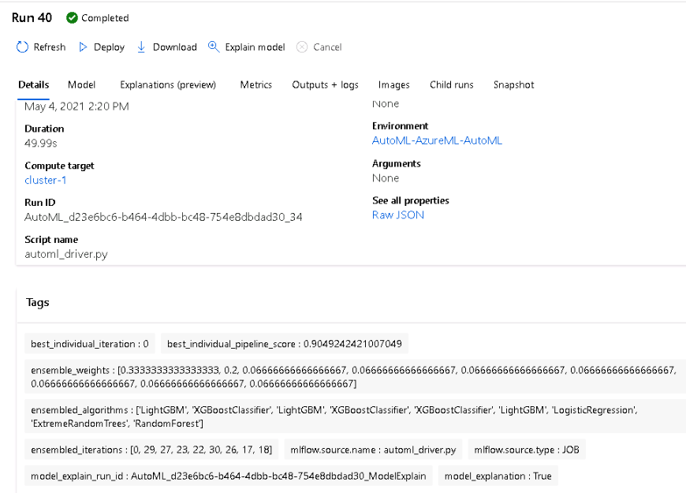
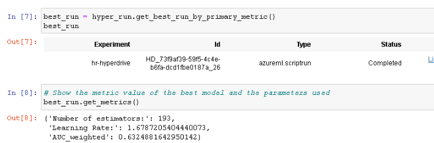
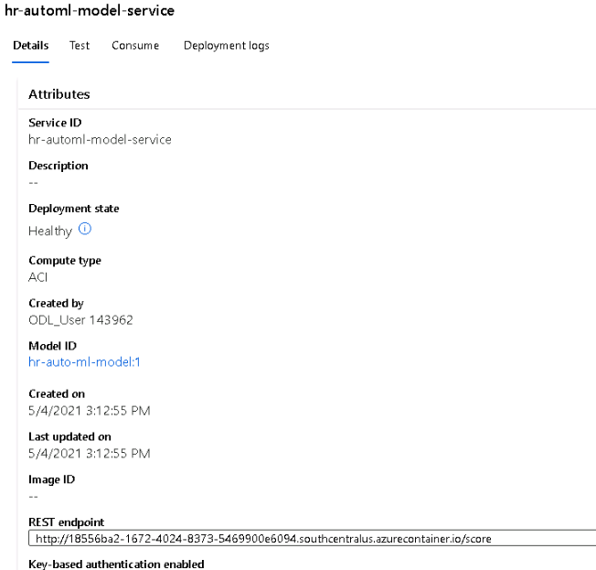
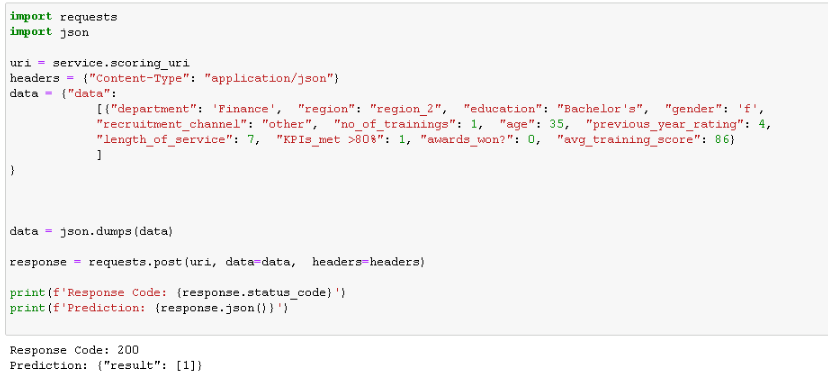

# Prediciton of Employee Promotions with Azure ML 

During this project we demonstrated the main capabilities of Azure ML to train and deploy ML models.
For this purpose we selected a public dataset containing personal information of employees of a company and their performance.

We first let AutoML find a model for the task. 
Then, we manually created  a training script for an AdaBoost model and proceeded to optimize its hypermarameters using an Hyperdrive run.
We compared the result of both experiments and kept the best model.
Finally we deployed the best of the models, making it available to use via a REST API.  

## Dataset

### Overview
For this project we used a dataset containing information about the employees of a company.
The data includes personal information and work performance metrics for each employee.

The dataset is publicly available for Kaggle users [here](https://www.kaggle.com/shivan118/hranalysis).
Credit: Kaggle user [shivan118](https://www.kaggle.com/shivan118)
 

### Task
The target is to to predict if an employee is likely o receive a promotion given their personal data and work performance metrics.
The dataset is imbalanced with only 5% of the employees in the dataset having obtained a promotion.
The problem is a classical imbalanced binary classification problem.

### Access
To access the dataset we manually registered it with the name "hr-data" as a tabular dataset. 
We took the chance to directly remove columns that are unnecessary for training (e.g. Id). 

 
Once the model was registered, we are able to access it from our workspace by name

## Automated ML
We first solved the task by using AutoML. 
Our task is a classification task. 
To optimize the running time we allowed AutoMl to stop early if a best score is found.
We also allowed up to 3 parallel runs and limited the total run time to 30 minutes. 
Finally we chose the weighted AUC as metric since it is an appropriate metric for the imbalanced task.

### Results
We submitted the run and monitor it with the run details widget.

The best model found by AutoML was a voting ensemble with 0.90543 weighted AUC.

We can check the parameters of the model in the tags. 
The resulting ensemble contains 9 different models with their respective weights.

The resulting model is already very good. 
We could try increasing the allowed time to run auto ML, but the performance increase would be probably minimal.

## Hyperparameter Tuning
We created a training script which also cleans the data and fist an Adaboost model.
We chose this algorithm since it generally gives good results, therefore it is worth to try in first step.

We decided to include the number of estimators in the ensemble and the learning rate as parameters to optimize.
We randomly sampled the hyperparameters uniformly.
The number of estimators in the ensemble was kept between 20 and 200, while the learning rate between 0,5 and 2.
The task was to optimize the weighted AUC, so we can compare to AutoML results.

### Results
We submitted the experiment and monitored it with the run details widget

Our best model had a poor performance, the weighted AUC was 0.633. 
The corresponding parameters were 154 estimators and a learning rate of 1.82.

 

We notice that the learning rate for the optimal model is close to our maximum boundary of the sampling spave (2).
This gives an indication that we should expand the sampling grid in the upper direction. 
This could possible lead to better models.

## Model Deployment
We took the resulting model of the AutoML run and proceeded to deploy it as a REST endpoint.
The easiest way to deploy the model is by using the azure web console. 
However, we decided to manually deploy via the python skd.

To manuaally deploy a model we need the following:
- Registering the model (the pickle file containing the actual model)
- Create an environment to run the model when performing inference. 
AutoMl gives with every run a conda specification file we can use for this.
- Create an entrypoint script used by the web service to process the input and make a prediction.
AutoMl also porvides this file for every run.
- Specify where is the model to be deployed and which resources are needed. 
We chose ACI with 1GB memory and 1 cpu core.
- Deploy the webservice using the configurations mentioned above.

 

After deployment, we need to wait some minutes until the service is ready for consumption.
After that we can see the model marked as healty and get the entrypoint URI in the web console.

 

We can finally make predictions on new data via post request with any client we want. 
In this case we did not specify authentication, but in production systems it is very important to secure the entrypoint with an API key or other authenticacion mechanism.

The following image gives an example of how to make predictions with the API via python

 

In this case th example employee gets a response "0" meaning they will not get a promotion.

## Screen Recording
We created a screencast explaining the model deployment process. 
We included a working demo of how to query the model.
The deployed model is available in youtube [https://youtu.be/ELgAsQlBc-0]
