# Project: Operationalize ML with Azure

This project explored the deployment of Ml models and pipelines with Azure. As an exmaple dataset we used the bank marketing dataset (mor information [here](https://archive.ics.uci.edu/ml/datasets/Bank+Marketing)). However the focus of this project is not the modeling itself, but its deployment. The following diagram contains a general overview of the project.

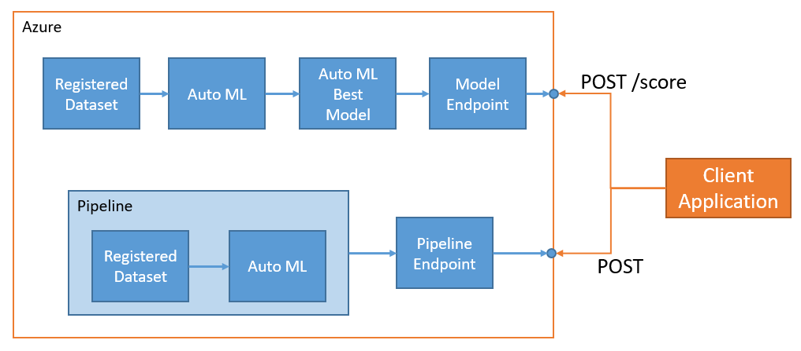

In the first partof the project (upper part of the diagram) we ran an AutoML experiment on the registered dataset. Then we took the resulting best model and deployed it. The result is an enpoint on which we can make predicions on new data points via a POST request.

In the second part of the project we operationalized a Pipline (AutoML). This involves creating the pipeline and making it available via an endpoint. This way, the existing pipeline can be rerun by any authorized used by simply making a POST request to an endpoint.

A quick overview of the project results is avaliable at https://youtu.be/uFgbnzW5HUY (telecast)

## Part 1: Deploy an ML Model

We started from an existing registered dataset containing the bank marketing data
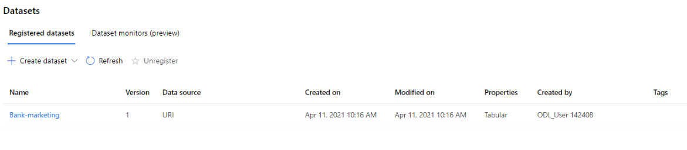

Then we proceeded to run an AutoML experiment on the dataset
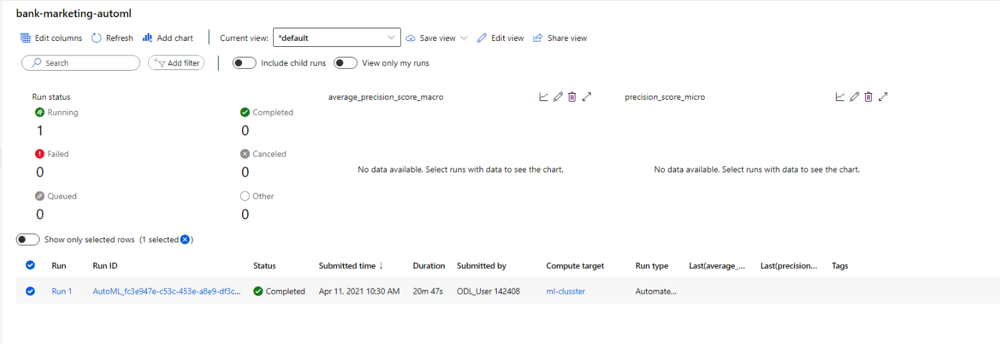

The best model found by AutoML was a Voting Ensemble with 91.86% accuray. We proceeded to deploy that model.
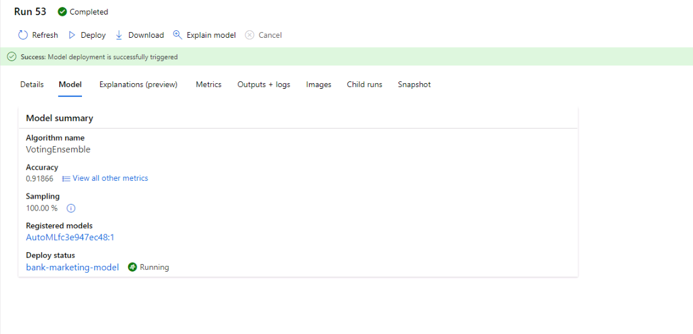

We also activated applications insights for the deployed model. This is useful to be able to debug and find issues in the deployment.
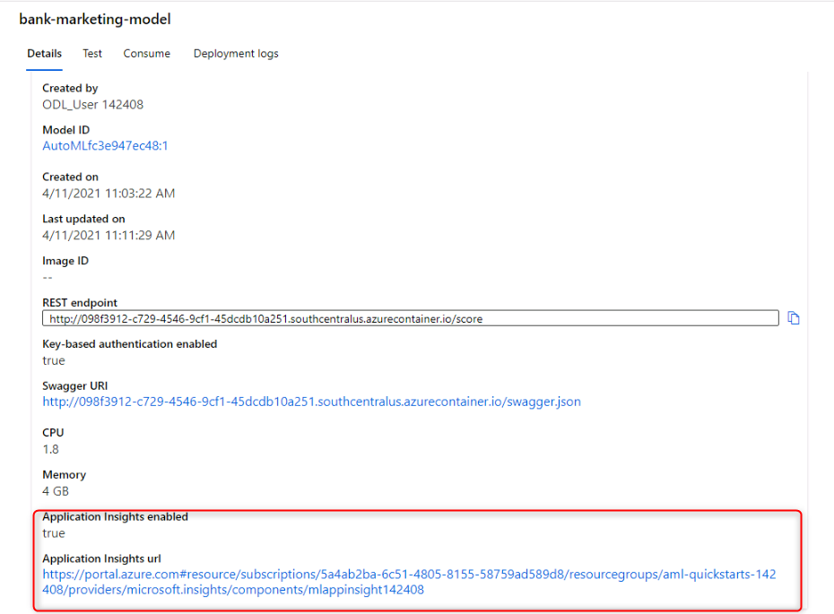

We can explore the logs to check the most current requests and responses. We used a helper python script to display the logs.
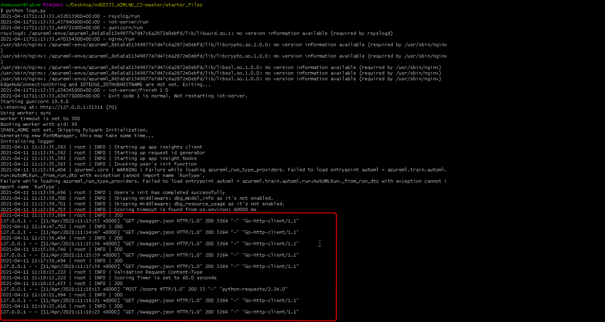

Additionally, Azure ML provides documenation of the model. We were able to display the documentation by using a local instance of swagger UI.

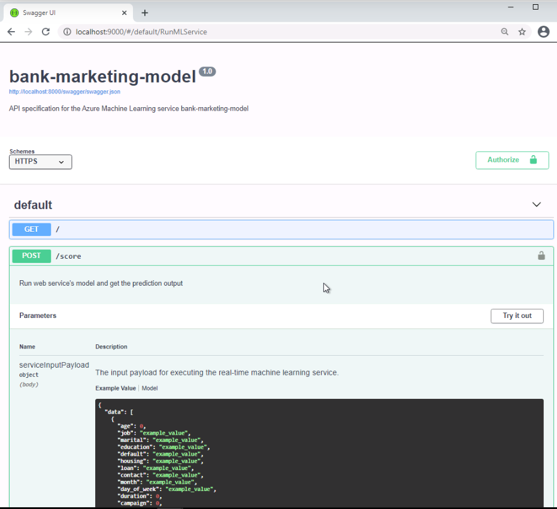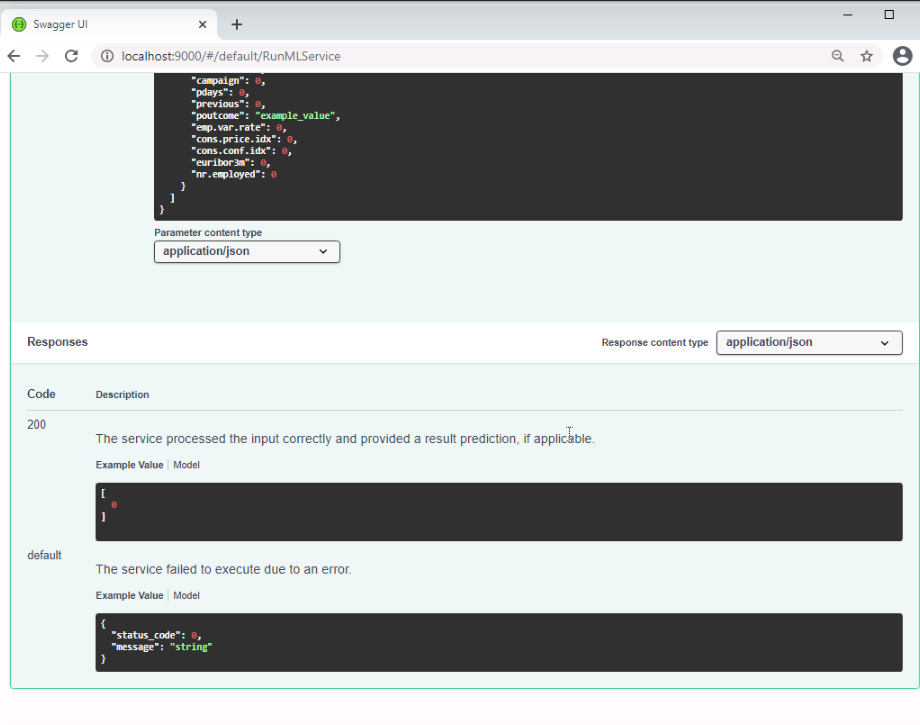

Finally we are able to make predicitons with the published model via POST request. We used a helper python file for this. The image shows the predicted classes for two data points.

It is important getting a good idea of the performace of the API. For this we used Apache benchmark. It works by sending multiple requests to our deployed model and registering the success rate and the response speed. In the benchmark test all the requests were successful with an average respons etime of 225ms.

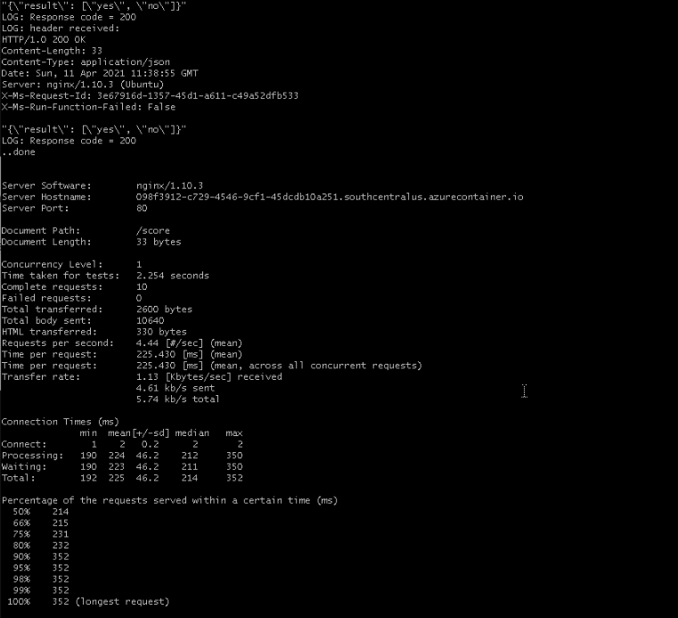

## Part 2: Deploying a ML Pipeline

We created a pipeline via the Python SKD. We can observe the pipeline runs in the Azure ML portal.
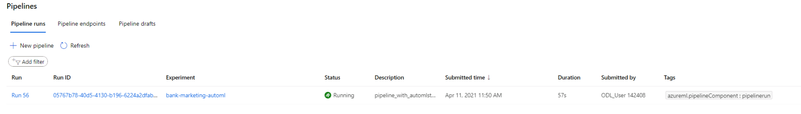

We then deployed the piepline so it can be rerun in the future via POST request. We can observe the corresponding endpoint in the pipline endpoints section.
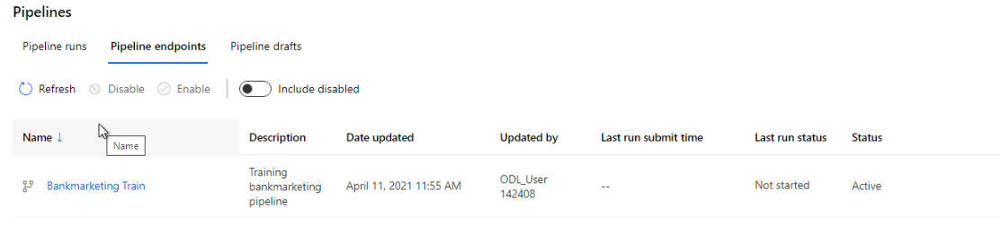

The pipeline only containes a single AutoML step with the bank dataset as input.
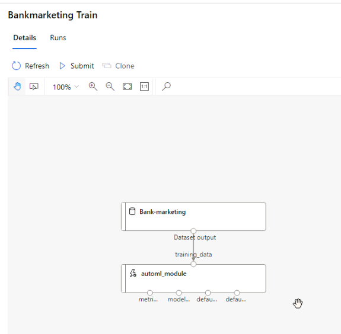

In the overview, we can see the active endpoint. This endpoint can now be used to triger a pipeline run.
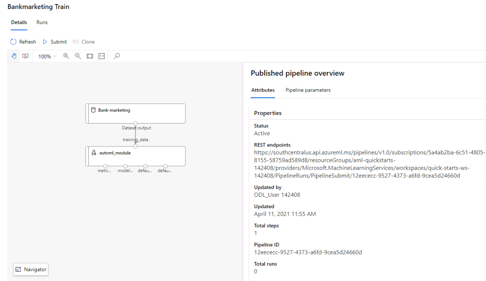

By using the RunDetails widget we can moritor the run of our pipeline
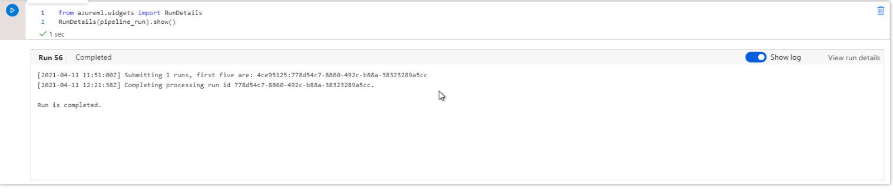

Finaly we used the REST endpoint to trigger a new run of the pipeline. We used a nex experiment "pipeline-res-endpoint" an verified in the portal if the run was created successfully.

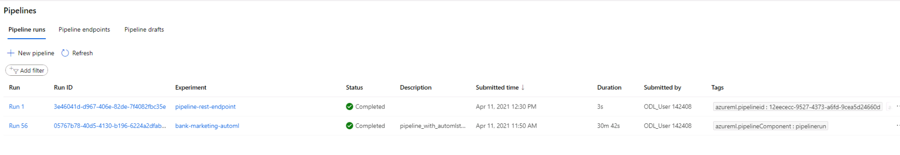

## Outlook and further work.

In this project we were able to deploy a single model as well as a training pipeline. A good next step could be to integrate the published enpoinds with other applications. The model endpoint could be used in a web tool to determine if a specifi customer would accept the marketing offer by the bank. We could also set a trigger to the pipeline entrypoint to run evertime we get a new dataset, this way we would have an upated model without manual effort.
